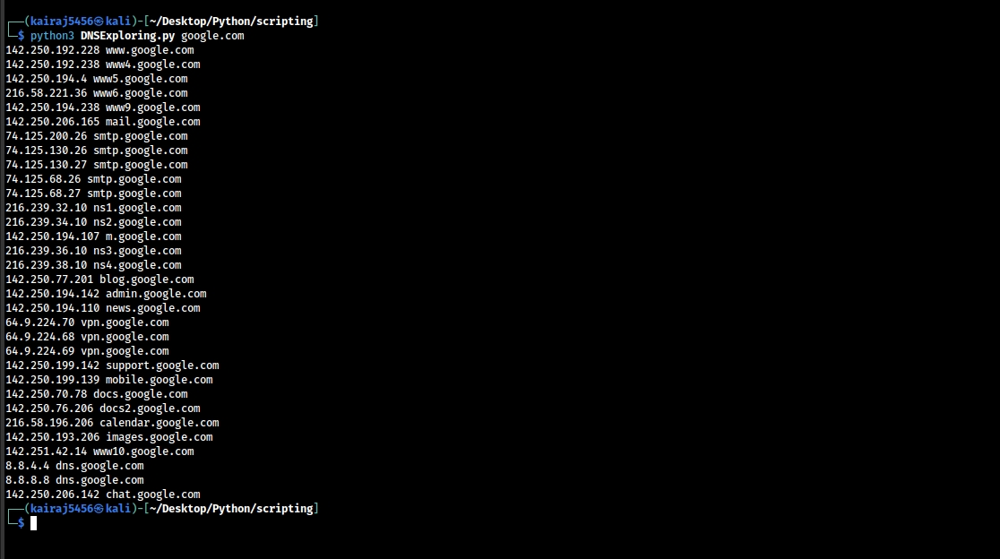

# DNS Exploring Tool
This Python script is designed to enumerate subdomains for a given domain by performing DNS requests and reverse DNS lookups. The script reads a list of potential subdomains from a file and attempts to resolve them, printing out the results.

**Prerequisites**

Ensure you have the following Python libraries installed:
  - socket
  - dnspython (which includes dns and dns.resolver)

You can install dnspython using pip if you don't have it installed already:
```bash
pip install dnspython
```
**Usage**

To run the script, use the following command:
```bash
python3 dnsExploring.py <domain name>
```
Replace `<domain name>` with the domain you want to search subdomains for

**Example**

```bash
python dnsExploring.py example.com
```
**Files**

- dnsExploring.py: The main script file.
- top10subs.txt: A text file containing a list of 10 common subdomains to check. Each subdomain should be on a new line.
- top100subs.txt: A text file containing a list of 100 common subdomains to check. Each subdomain should be on a new line.
- top10000subs.txt: A text file containing a list of 10,000 common subdomains to check. Each subdomain should be on a new line.

**Note**

You can replace the name of the subdomain file used in the script by changing the value of the variable d. By default, the script uses top100subs.txt. To use a different file, modify the d variable at the beginning of the script accordingly.

For example, to use top10subs.txt:

```python
  d = "top10subs.txt"
```

**Screenshot**


